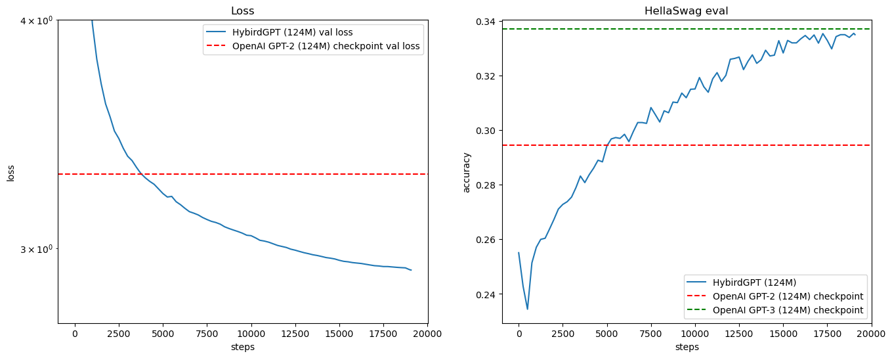

# HybridGPT

HybridGPT is my learning project for Little Languge Models (LLMs).  
The model is based on GPT-2 and inspired by:

- [nanoGPT](https://github.com/karpathy/nanoGPT)
- [OpenAI GPT-2](https://github.com/openai/gpt-2)
- [LLaMA 3](https://github.com/meta-llama/llama3)
- [DeepSeek-V3](https://github.com/deepseek-ai/DeepSeek-V3)

## Dataset

- **Training**: [fineweb-edu (10B)](https://huggingface.co/datasets/HuggingFaceFW/fineweb-edu)  
- **Evaluation**: [HellaSwag](https://arxiv.org/abs/1905.07830)

## Training Progress

